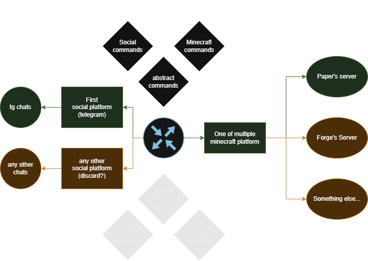

# SocialBridge

### SocialBridge is crossplatform minecraft plugin, who provided API for connect minecraft with multiple social platforms



### Supported minecraft cores:
* Paper\Folia 1.21.8+
* TO DO others

### Supported social platforms:

- [Telegram](https://github.com/KosyakMakc/social-bridge-telegram)

### Awesome hotplug modules:

| Module name | Description |
|-------------|-------------|
| [AuthSocial](https://github.com/KosyakMakc/AuthSocial) | Authentication module for SocialBridge minecraft plugin |

## Notes

1. Modules and social platforms are hotplug, they are can be enabled\disabled (loaded\unloaded) in runtime without server reboot
2. Connecting\disconnecting modules and social platforms generates events in container `(BridgeEvents) ISocialBridge.getEvents();`
3. Minecraft crossplatform API available via `(IMinecraftPlatform) ISocialBridge.getMinecraftPlatform()`, but new functionality (crossplatform or platform-specific) can be expanded by modules.
4. Specific module can be accessed via `TModule ISocialBridge.getModule(Class<TModule> tClass);`
5. Social crossplatform API available via `(Collection<ISocialPlatform>) ISocialBridge.getSocialPlatforms()`, please note that there may be multiple social platforms (include multiple social platforms for one socials).
6. Specific social platform can be accessed via `TSocialPlatform ISocialBridge.getSocialPlatform(Class<TSocialPlatform> tClass)`
7. Contract `ISocialBridge` have some methods for connect\disconnect modules and social platforms, it means that one module can manage other modules and social platforms

## API for developers

### You can connect API for your purposes
```
repositories {
    maven {
        name = "gitea"
        url = "https://git.kosyakmakc.ru/api/packages/kosyakmakc/maven"
    }
}
dependencies {
    compileOnly "io.github.kosyakmakc:SocialBridge:0.5.3"
}
```